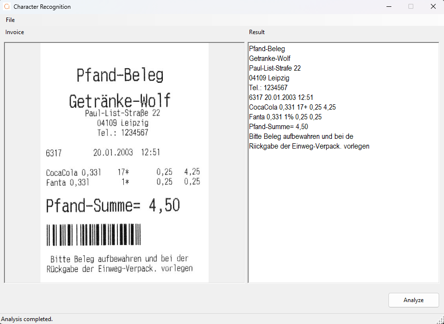

# OpenCV Character Recognition

A Windows Forms application for OCR text extraction from images using [EmguCV](https://github.com/emgucv/emgucv) and [Tesseract](https://github.com/tesseract-ocr).

## About This Project

This project was originally created ten years ago and remained unchanged since then. In 2025 I decided to modernize it and remove the cumbersome manual EmguCV/OpenCV installation process. The new version uses NuGet packages instead, making setup much simpler.

## Features

- OCR text extraction from images
- Support for multiple image formats (JPG, PNG, GIF, BMP)
- Modern async/await patterns for responsive UI
- No manual environment setup required
- All dependencies managed through NuGet

## Requirements

- Windows 10 or later
- .NET 10 SDK
- Visual Studio 2022 or VS Code with C# Dev Kit

## Setup

No manual environment configuration needed. The build process automatically downloads required Tesseract language data.

```bash
git clone https://github.com/brakmic/OpenCV.git
cd OpenCV
dotnet build
```

The first build will download tessdata files automatically.

### Additional Languages

By default, only English language data is downloaded. To use other languages, download them manually using the provided script.

Example for German:

```bash
pwsh -ExecutionPolicy Bypass -File scripts/Download-Tessdata.ps1 -TessdataPath CharacterRecognition/tessdata -Language deu
```

Then update the `Language` property in `CharacterRecognition/appsettings.json` to match your chosen language code.

Available language codes: `eng`, `deu`, `fra`, `spa`, `ita`, `por`, and [many more](https://github.com/tesseract-ocr/tessdata).

## Running the Application

```bash
dotnet run --project CharacterRecognition/CharacterRecognition.csproj
```

Or open `OpenCV.sln` in Visual Studio and press F5.

## Usage

1. Start the application
2. Load one of the sample images from the **Assets** folder (these are invoice documents)
3. Click on **Analyze** and wait for the OCR task to complete
4. View the extracted text in the result window



## Technical Details

- **Framework**: .NET 10
- **UI**: Windows Forms
- **OCR Engine**: Tesseract 4 via EmguCV 4.12
- **Architecture**: x64

## License

[MIT](LICENSE)


